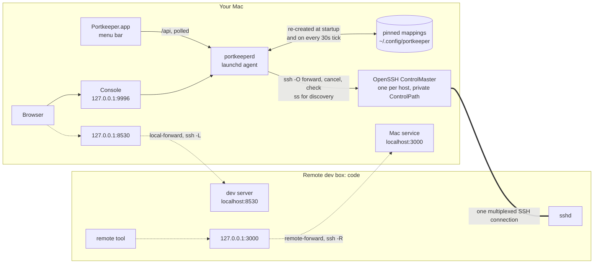

# portkeeper

Port mappings between your Mac and a remote dev box, without hand-rolling `ssh -L`.

portkeeper is a daemon on the Mac that keeps SSH port mappings to your remote dev boxes
alive. It owns one OpenSSH ControlMaster per host and adds or drops forwards on it on
demand, and you drive it from a web console or a menu-bar app. Nothing on the remote can
reach the daemon: its listener is loopback-only and no port is forwarded to it.

Two directions, named after the ssh flags they become:

| Direction        | ssh  | What it gets you                                                     |
| ---------------- | ---- | -------------------------------------------------------------------- |
| `local-forward`  | `-L` | A dev server on `code` opens in your Mac's browser                    |
| `remote-forward` | `-R` | A service on your Mac (notifications, an API) is callable from `code` |

This README describes what portkeeper is today. `DESIGN.md` records why it works this
way, and what it used to be.

## How it works



Solid arrows are control: how a mapping is asked for and kept. The thick line is the one
SSH connection the daemon owns per host. Dotted arrows are traffic through a mapping, and
every one of them rides that thick line; ssh binds the listening end and delivers to the
other. Nothing points from `code` back at the daemon, because nothing there can reach it.

Every thirty seconds the daemon checks each master, restarts and replays a dead one with
backoff, dials every local-forward to prove it still answers, and re-creates any pin
whose mapping is missing.

## Install the app

Download `Portkeeper-<tag>-macos-arm64.zip` from the repository's
[Releases page](https://github.com/johnlofty/portkeeper/releases). The repository is
currently private, so that page is only reachable by its collaborators until it is made
public.

The build is Apple Silicon only. It is ad-hoc signed and **not notarized**, so on macOS 15
and later a downloaded copy is blocked the first time you open it. To get past that:

1. Unzip it and move `Portkeeper.app` to `/Applications` first, and launch it from there.
   Registering the background helper records where the app is, so a copy registered from
   `~/Downloads` breaks when it moves.
2. Open it. When macOS refuses, go to System Settings > Privacy & Security and click
   **Open Anyway**. Or clear the quarantine flag yourself:
   `xattr -dr com.apple.quarantine /Applications/Portkeeper.app`
3. In the app's Settings > Background helper, click **Register**. If macOS asks, approve it
   once in System Settings > Login Items; until then the helper is registered but never
   starts, and Settings says so.

You need macOS 14 or later, OpenSSH with your hosts in `~/.ssh/config`, and ssh keys or an
agent that let `ssh <host>` connect without a prompt.

## Install from the repo

| Target             | What it does |
| ------------------ | ------------ |
| `make install`     | Builds `bin/portkeeperd`, renders the tracked plist with this checkout's path into `~/Library/LaunchAgents/io.github.johnlofty.portkeeper.plist`, and loads it |
| `make uninstall`   | Unloads that agent and removes its plist |
| `make app`         | Builds `build/Portkeeper.app`, the Swift app with `portkeeperd` bundled inside, ad-hoc signed. Registers nothing |
| `make app-install` | Builds the app, unloads and removes the dev agent, and copies the bundle to `~/Applications/Portkeeper.app` |
| `make dist`        | Builds the app and zips it with `ditto` to `dist/Portkeeper-$(VERSION)-macos-arm64.zip` (`VERSION` defaults to `dev`) |
| `make build`, `make run` | Builds the daemon; runs it in the foreground |

**Only one daemon can run.** The dev agent (`io.github.johnlofty.portkeeper`, from
`make install`) and the bundled helper (`io.github.johnlofty.portkeeper.helper`, inside
the app) both bind 127.0.0.1:9996, and the listen port is the daemon's singleton lock:
whichever starts second exits on it, and launchd keeps retrying it, filling the log. To
try the app against the dev agent, open `build/Portkeeper.app` and leave the helper
unregistered. To switch to the helper, run `make app-install`, then register from
Settings in `~/Applications/Portkeeper.app`, the copy that will stay.

Either way the daemon uses its own private ControlPath, so it never fights your
interactive sessions for a socket. Quitting the app does not stop the daemon or drop any
mapping; launchd owns it.

## The console

<http://127.0.0.1:9996/> on the Mac (or `localhost:9996`). The left rail lists hosts: the
`LG_HOSTS` entries, the `Host` aliases in `~/.ssh/config` (patterns such as `Host *`
are skipped), and any you add there (saved to
`~/.config/portkeeper/hosts`). Picking one shows its mappings as a table of cables, remote
port on one side and Mac port on the other, with the arrow pointing where the port
appears, and a row's state (alive, dead, or reconnecting with the attempt count).

**Add mapping** opens a sheet: direction, remote port or range, local port (blank to
mirror), target host on the remote, a label, an expiry of 1h, 8h, 24h or never, **Keep
across restarts**, and whether to open it in the browser when ready. Rows can be edited,
pinned and closed. **Listening on** asks the host what it is running and offers a Forward
button per port. Opening the console at `/#add` goes straight to the sheet. The page
follows the system's light or dark appearance.

There is no login. What protects the console is that the daemon refuses cross-site
browser requests:

- a request whose `Host` is not the daemon's own address gets a 400;
- one the browser marks as coming from another site or origin (`Sec-Fetch-Site` other
  than `same-origin` or `none`, or a foreign `Origin`) gets a 403;
- a write whose body is not `application/json` gets a 415.

`GET /`, the page shell, gets the Host check only, so following a link to it still works.
So a web page open in your browser, including a dev server you have forwarded to
`127.0.0.1`, cannot drive it. A request with no browser headers at all is served, so
`curl` from a terminal works:

```sh
curl -s http://127.0.0.1:9996/api/status
curl -s http://127.0.0.1:9996/api/forwards
curl -s -X POST -H 'Content-Type: application/json' \
     -d '{"remote_port":8530}' http://127.0.0.1:9996/api/forward
```

The other routes are `PATCH` and `DELETE /api/forward/{ref}`, `GET` and `POST /api/hosts`,
`DELETE /api/hosts/{alias}`, and `GET /api/hosts/{alias}/listeners`.

What is deliberately not defended: anything running as you on the Mac can reach the
daemon, as it can read the ssh keys the daemon uses. The listener refuses to bind anything
but loopback, and no mapping may use the daemon's own port as its local port, since a
remote-forward of it would publish the console on the remote.

Upgrading from an older version: the login, the `/admin` routes, `expose` and the
`RemoteForward 9996` control channel are removed; see `DESIGN.md`. Nothing reads
`~/.config/portkeeper/admin-password` any more, so delete it when you like.

## The menu-bar app

The menu-bar item shows the count of mappings that are alive, or `!` when a host is
reconnecting or the daemon cannot be reached. The popover lists each host, connected or
reconnecting with its next retry, and under it each mapping as a remote chip, a cable and
a Mac chip, with its label, a pin mark if it is kept across restarts, and a button to open
a local-forward in the browser. It polls `GET /api/forwards` and `GET /api/status` on
`http://127.0.0.1:9996` every two seconds, and posts a notification when a host
reconnects or a mapping goes away.

**Open console** shows the web console in a window of its own; **Add mapping** opens that
window on `/#add`. The app has no native form and writes nothing itself.

Settings has **Open at login** (the app as a login item), **Background helper** (its
status, Register and Unregister, and a button to Login Items when approval is pending),
and **Daemon** (its address, state and API version, and a button to open the log). Both
registrations go through SMAppService.

## Configuration

The daemon reads environment variables; in the launchd plist they go under
`EnvironmentVariables`.

| Variable          | Default                                  | Meaning |
| ----------------- | ---------------------------------------- | ------- |
| `LG_LISTEN`       | `127.0.0.1:9996`                         | Console and API address; must be loopback |
| `LG_HOSTS`        | `code`                                   | Comma-separated hosts whose masters open at startup |
| `LG_SSH_CONFIG`   | `~/.ssh/config`                          | Where `Host` entries are discovered |
| `LG_HOSTS_FILE`   | `~/.config/portkeeper/hosts`             | Hosts added in the console |
| `LG_PINNED_FILE`  | `~/.config/portkeeper/pinned`            | Mappings kept across restarts |
| `LG_MAX_FORWARDS` | `20`                                     | Cap on mappings |
| `LG_DEFAULT_TTL`  | `28800` (seconds)                        | Expiry when a request gives none |
| `LG_CONTROL_PATH` | `~/.ssh/sockets/portkeeper-%r@%h-%p`     | The daemon's own ControlPath |

Hosts not in `LG_HOSTS` are dialled on first use. The hosts and pinned files are written
0600 in a 0700 directory. Both launchd jobs log to `/tmp/portkeeper.log`.

## Behaviors worth knowing

**Pins.** A pinned mapping is re-created at startup and on any tick that finds it
missing. Pinning clears the expiry, and closing a pinned mapping removes the pin. A pin to
a host known only from `~/.ssh/config` brings that host's connection up at startup.

**Discovery.** **Listening on** runs `ss` (or `netstat`) and `docker ps` on the host,
capped at 15 seconds. Ports already mapped are marked rather than hidden.

**Target host past the remote.** A local-forward may target a machine the remote can
reach, such as a database box, via **target host on remote** or `remote_host`. It is
validated like a host alias: letters, digits, dot, dash, underscore, no leading dash, no
colons. IPv4 addresses pass; IPv6 literals are not supported. These mappings get a longer
id, `code:local-forward:db:5432`.

**Ranges.** `8000-8010` in the remote port field makes one independent mapping per port,
up to 32 per request, within `LG_MAX_FORWARDS`. If one fails, only the ones that request
created are rolled back. Editing does not take ranges.

**Reconnecting.** A mapping on a host whose connection is down reads **reconnecting**, not
dead. Retries back off 30s, 1m, 2m, 4m, 8m, then every 10 minutes, and never stop. Asking
for a forward to that host retries at once. `GET /api/status` carries the per-host detail
under `hosts`, and the `LG_HOSTS` list under `eager_hosts`.

**Clean restarts.** A control socket left behind by a killed master is detected and
removed before a new one starts, and a new master gets three seconds to settle before any
forward is sent to it.

`DESIGN.md` has the reasoning for each of these, and the incidents behind the last two.

## Checking it works

```sh
make status                                  # is the dev agent loaded
make logs                                    # tail /tmp/portkeeper.log
ssh -o 'ControlPath=~/.ssh/sockets/portkeeper-%r@%h-%p' -O check code
                                             # is the daemon's master up
```

The log starts with `listening on 127.0.0.1:9996, hosts [code]` and says
`master code: up` a few seconds later. If it says `still not ready` on every retry, the
host is unreachable or the connection is failing, and the console's rows for that host
read **reconnecting** with the attempt count. `make status` greps `launchctl list` for
`io.github.johnlofty.portkeeper`, which matches the helper's label too; the app's Settings
also shows the helper's state.

## Development

`make test`, `make vet` and `make fmt` run `go test`, `go vet` and `gofmt` over the
daemon. `make check` lints the launchd plist with `plutil`, since no compiler reads it.

The Swift package is in `macos/Portkeeper`: `swift build -c release` and `swift test`.
`swift test` needs XCTest from Xcode: if `xcode-select -p` points at the Command Line
Tools, prefix it with `DEVELOPER_DIR=/Applications/Xcode.app/Contents/Developer`.
`macos/build-app.sh`, behind `make app`, does that for itself.

CI (`.github/workflows/ci.yml`) runs on every push to `main` and every pull request, on a
`macos-15` runner: gofmt, vet, `go test -race`, `make check`, the Swift build and tests,
then `make dist`, uploading the zip as a workflow artifact. The release workflow
(`.github/workflows/release.yml`) runs on every `v*` tag: it builds with
`make dist VERSION=<tag>`, verifies the bundle's signature and plists, and publishes
`Portkeeper-<tag>-macos-arm64.zip` to GitHub Releases. To cut a release:

```sh
git tag v0.1.0 && git push origin v0.1.0
```

## License

[Anti 996 License, Version 1.0](https://github.com/996icu/996.ICU/blob/master/LICENSE) — see [LICENSE](LICENSE).
