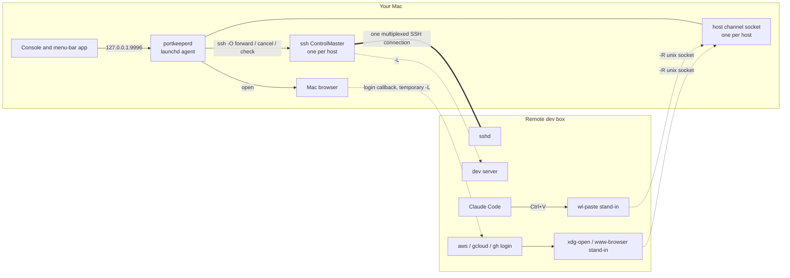

# Portkeeper

Portkeeper keeps SSH connections from your Mac to your remote dev boxes, and makes working
on them feel local. It handles port mappings in both directions, pastes Mac screenshots
into Claude Code on the remote, and opens CLI logins such as `aws sso login` in your Mac's
browser. It is a menu-bar app with a small daemon behind it. You drive it from a web
console, and nothing on the remote can reach the daemon's controls.

`DESIGN.md` records why it works the way it does, and the incidents that shaped it.

## Features

| Feature | What you get |
| --- | --- |
| **Port mappings** | A dev server on the remote opens on your Mac, and a Mac service is reachable from the remote. Ranges, expiry and pins are supported |
| **Discovery** | Every port the remote listens on, with its process or container, and a one-click Forward |
| **Image paste** | Ctrl+V in Claude Code on the remote attaches your Mac's screenshot |
| **Browser login** | `aws sso login`, `gcloud`, `az`, `gh` and other CLI logins on the remote open in your Mac's browser, and finish on the remote after one click |
| **Self-healing** | Connections reconnect with backoff, mappings are replayed, pins and host features return after restarts, and upgrading the app restarts the daemon |
| **Your ssh config, untouched** | Hosts come from `~/.ssh/config`, plus any you add in the console; the file is read, never written |

**Port mappings, both directions.** Named after the ssh flags they become:

| Direction        | ssh  | What it gets you                                               |
| ---------------- | ---- | -------------------------------------------------------------- |
| `local-forward`  | `-L` | A dev server on the remote opens in your Mac's browser         |
| `remote-forward` | `-R` | A service on your Mac is callable from the remote              |

A mapping can use a different local port, cover a range (`8000-8010`), target a machine
the remote can reach (such as a database box), expire after a set time, or be **pinned**
to survive restarts.

**Discovery.** **Listening on** shows every port the remote is listening on, with its
process or docker container, and a **Forward** button for each one.

**Image paste into Claude Code.** Turn it on for a host, copy a screenshot on the Mac
(Ctrl+Shift+Cmd+4), and press **Ctrl+V** in Claude Code on that host. It attaches
`[Image #1]`, just as it does locally. Only images leave the Mac, never clipboard text.

**Browser login.** Turn it on for a host, then run a CLI login there. The sign-in page
opens in your Mac's browser. You click **Allow**, and the CLI on the remote finishes by
itself, with no URL or code to copy. It covers both kinds of CLI login:

- **Device code:** the page opens on the Mac, and you confirm the code it shows.
- **Loopback callback:** the CLI waits on `127.0.0.1:<port>` on the remote. Portkeeper
  forwards that port from the Mac for the few minutes the login takes, so the provider's
  redirect reaches the CLI.

| Tool | Flow | Status |
| --- | --- | --- |
| `aws sso login` (legacy `sso_start_url` profiles) | device code | verified |
| `aws sso login` (`sso_session` profiles) | loopback | verified |
| `gh auth login` | device code | expected: trusted provider, not yet tested |
| `gcloud auth login`, `az login` | loopback | expected: trusted provider, not yet tested |
| `terraform login`, anything calling `xdg-open` | loopback or plain | expected: trusted provider, not yet tested |

Only pages on trusted sign-in providers open: AWS, Google, Microsoft, GitHub and
HashiCorp. Any other link is refused, and the tool prints its URL as it would without a
browser.

**Stays up by itself.** Dropped connections reconnect with backoff, and mappings are
replayed onto the new connection. Pinned mappings, image paste and browser login come
back after a restart of the daemon or the Mac. Opening a new version of the app restarts
the daemon on that version.

**Your ssh config, untouched.** Hosts come from the `Host` entries in `~/.ssh/config`,
plus any you add in the console. Portkeeper reads that file and never writes it.

## Install

Apple Silicon, macOS 14 or later. `ssh <alias>` must connect without a password prompt,
using keys or an agent.

1. Download `Portkeeper-<version>-macos-arm64.zip` from
   [Releases](https://github.com/johnlofty/portkeeper/releases). Move `Portkeeper.app` to
   `/Applications` and open it from there.
2. The app is ad-hoc signed, not notarized, so macOS blocks the first launch. Click
   **Open Anyway** in System Settings > Privacy & Security, or run
   `xattr -dr com.apple.quarantine /Applications/Portkeeper.app`.
3. Click the menu-bar icon, then the gear, then **Background daemon > Install**. The app
   writes a LaunchAgent at `~/Library/LaunchAgents/io.github.johnlofty.portkeeper.plist`
   that runs the daemon inside the app. **Daemon** in Settings then reads reachable.

**Upgrading.** Replace the app in `/Applications` and open it. The app sees that the
running daemon is a different version and restarts it from the new copy. Mappings that
are not pinned are dropped by the restart.

To uninstall, click **Uninstall** in Settings, quit, and delete the app and
`~/.config/portkeeper`.

## Using it

Open the console from the menu-bar popover, or at <http://127.0.0.1:9996/>. Pick a host
on the left.

- **Map a port.** Click **Add mapping**, type the remote port, and confirm. A Vite server
  on `localhost:5173` on the remote then opens at `http://127.0.0.1:5173` on the Mac. Tick
  **Keep across restarts** to pin the mapping. In each row, the arrow points to the side
  where the port appears.
- **Paste images.** Click **Enable image paste**. The button reads **Image paste on**
  once the host is ready. Cmd+V stays the terminal's ordinary text paste; Ctrl+V pastes
  the image.
- **Log in from the remote.** Click **Enable browser login**, then run
  `aws sso login --profile <name>` (or `gcloud auth login`, `gh auth login`, …) in a
  terminal on the host. The page opens on the Mac. A Python tool run outside a terminal
  (no `TERM`) also needs `export BROWSER=portkeeper-open` on the host.

The popover shows each host's state and its mappings. Quitting the app leaves the daemon
and every mapping running.

## How it works



**One connection per host.** The daemon runs one OpenSSH ControlMaster per host, on its
own ControlPath, so it never touches your interactive sessions. A mapping is a
`ssh -O forward` on that master, and closing it is a `-O cancel`. Every ssh the daemon
runs is given a generated config with `-F`, which includes the hosts added in the
console and then your own `~/.ssh/config`.

**A reconcile loop.** Every 30 seconds the daemon checks each master, restarts a dead one
with backoff (30 s up to 10 minutes, never giving up), and replays its forwards. It also
checks that each mapping still answers and re-creates any pin that is missing. Mappings
live in memory. Pins, console-added hosts and the per-host feature settings are
configuration, kept under `~/.config/portkeeper/`.

**The host channel.** Image paste and browser login share one unix socket per host,
forwarded over the host's master as
`-R ${XDG_RUNTIME_DIR:-~/.cache}/portkeeper/clip.sock:<local socket>`. The daemon checks
that the remote socket is mode 0600, so only your account on the host can open it, and
refuses to keep it otherwise. The socket is forwarded while either feature is on. Each
route answers only while its own feature is, and it shares nothing with the console's API
on 9996.

**Image paste.** On Linux, Claude Code reads the clipboard by running `xclip`, and then
`wl-paste` if that fails. A dev box reached over ssh has neither, so nothing gets
attached. Enabling image paste sets up three pieces:

1. **The Mac side.** The daemon reads the pasteboard itself, through AppKit
   (`pasteboard_darwin.go`), and converts TIFF-only images to PNG. It serves them on the
   host channel as `GET`/`HEAD /v1/clipboard/image`.
2. **The remote side.** A POSIX `sh` script at `~/.local/bin/wl-paste` fetches the PNG
   with `curl`, and fails like a missing `wl-paste` for anything else. It is `wl-paste`
   rather than `xclip` so it never shadows a working X11 clipboard. It is never installed
   over a `wl-paste` that isn't Portkeeper's. Turning image paste off removes it.

**Browser login.** CLIs open a browser through one of three hooks, and Portkeeper
installs a stand-in for each on the host. All three are the same POSIX `sh` script, which
uses `curl`:

- `xdg-open`, used by Go, Node and Rust tools and by scripts;
- `www-browser`, used by Python's `webbrowser` when there is no display and `TERM` is set;
- `portkeeper-open`, for `BROWSER=portkeeper-open`.

The stand-in sends `POST /v1/open` with the URL over the host channel and exits at once,
because callers wait for it. On the Mac, `browserlogin.go` takes these steps:

1. It refuses anything that is not `https` on a trusted sign-in provider.
2. If the URL's `redirect_uri` (or one inside a wrapped URL) points at
   `127.0.0.1`, `localhost` or `[::1]` with a port, it places a local-forward of exactly
   that port to the host. It never falls back to another port, since the number is in
   the URL.
3. Only then does it run `open`.

The forward has a 10-minute TTL, at most 3 exist per host, and it is closed as soon as the
tool stops listening. A stand-in is never written over a command that isn't
Portkeeper's. It hands anything that is not an `http(s)` URL, or a host with a desktop
session, to the real command, and it is removed when browser login is turned off.

**Security model.** The console listener binds loopback only, and nothing is forwarded to
it. There is no login. The daemon refuses cross-site browser requests instead: a foreign
`Host` header gets 400, a foreign `Origin` or `Sec-Fetch-Site` gets 403, and a write
that isn't JSON gets 415. A web page open in your browser therefore cannot drive it, while
`curl` from a terminal can. Anything running as you on the Mac can reach the daemon,
just as it can read the ssh keys the daemon uses.

Remote processes get only the host channel, and only on hosts where you turned a feature
on. There they can read the clipboard *image*, never its text, and open trusted sign-in
pages. For a login, they can also get one loopback port forwarded from the Mac to the
host, for at most 10 minutes. They cannot reach 9996, create a remote-forward, or open
arbitrary links. That is less than a process running as you on the host already has, such
as its token caches and your shell.

## Configuration

Everything has a default. For a daemon run from the repo, variables go in the launchd
plist under `EnvironmentVariables`.

| Variable              | Default                              | Meaning |
| --------------------- | ------------------------------------ | ------- |
| `LG_LISTEN`           | `127.0.0.1:9996`                     | Console and API address; must be loopback |
| `LG_HOSTS`            | none                                 | Hosts to connect at startup; others connect on first use |
| `LG_SSH_CONFIG`       | `~/.ssh/config`                      | Where `Host` entries are read from |
| `LG_HOSTS_FILE`       | `~/.config/portkeeper/hosts.conf`    | Hosts added in the console, as ssh_config |
| `LG_SSH_WRAPPER`      | `~/.config/portkeeper/ssh_config`    | Generated config passed to every daemon ssh with `-F` |
| `LG_KNOWN_HOSTS`      | `~/.config/portkeeper/known_hosts`   | Host keys of console-added hosts |
| `LG_PINNED_FILE`      | `~/.config/portkeeper/pinned`        | Pinned mappings |
| `LG_IMAGE_PASTE_FILE` | `~/.config/portkeeper/image-paste`   | Hosts with image paste on |
| `LG_BROWSER_LOGIN_FILE` | `~/.config/portkeeper/browser-login` | Hosts with browser login on |
| `LG_CLIP_DIR`         | `~/.config/portkeeper/clip`          | Per-host clipboard sockets; the path must fit in 104 bytes |
| `LG_CONTROL_PATH`     | `~/.ssh/sockets/portkeeper-%r@%h-%p` | The daemon's own ControlPath |
| `LG_MAX_FORWARDS`     | `20`                                 | Cap on mappings |
| `LG_DEFAULT_TTL`      | `28800` (seconds)                    | Expiry when a request gives none |

The daemon logs to `/tmp/portkeeper.log`.

## API

The console and the menu-bar app use the same JSON API, which `curl` can call too:

```sh
curl -s http://127.0.0.1:9996/api/status
curl -s -X POST -H 'Content-Type: application/json' \
     -d '{"host":"code","remote_port":8530}' http://127.0.0.1:9996/api/forward
curl -s -X PUT -H 'Content-Type: application/json' \
     -d '{"enabled":true}' http://127.0.0.1:9996/api/hosts/code/image-paste
```

The other routes:
- mappings: `GET /api/forwards`, `PATCH` and `DELETE /api/forward/{ref}`
- hosts: `GET` and `POST /api/hosts`, `PUT` and `DELETE /api/hosts/{alias}`, `POST /api/hosts/{alias}/test`
- discovery: `GET /api/hosts/{alias}/listeners`
- image paste: `GET /api/image-paste`
- browser login: `GET /api/browser-login`, `PUT /api/hosts/{alias}/browser-login`

## Development

| Target             | What it does |
| ------------------ | ------------ |
| `make test`, `make vet`, `make fmt` | `go test`, `go vet` and `gofmt` over the daemon |
| `make install`     | Builds `bin/portkeeperd` and loads it as a launchd agent from this checkout |
| `make uninstall`   | Unloads that agent |
| `make app`         | Builds `build/Portkeeper.app`, with the daemon bundled inside |
| `make dist`        | Zips the app to `dist/Portkeeper-$(VERSION)-macos-arm64.zip` |

Only one daemon can own `127.0.0.1:9996`. `make install` and the app share one launchd
label, so whichever installed last owns the job. The app leaves a job that points into a
checkout alone; **Install** in its Settings takes it back. The Swift app is in
`macos/Portkeeper`.

CI runs on a `macos-15` runner for every push and pull request: gofmt, vet,
`go test -race`, the Swift build and tests, and `make dist`. **Every merged pull request is
a release**, versioned by the PR's label: `release:major`, `release:minor`, none (a patch
bump) or `release:skip`.

## License

[Anti 996 License, Version 1.0](https://github.com/996icu/996.ICU/blob/master/LICENSE) — see [LICENSE](LICENSE).
