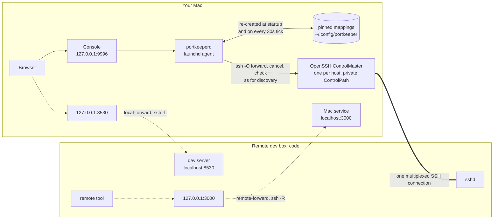

# portkeeper

Port mappings between your Mac and a remote dev box, without hand-rolling `ssh -L`.

A daemon on the Mac owns one SSH ControlMaster per host and adds or drops forwards on it
on demand. You drive it from a web console on the Mac. Nothing on the remote can reach the
daemon: its listener is loopback-only and no port is forwarded to it.

Two directions, named after the ssh flags they become:

| Direction        | ssh  | What it gets you                                                     |
| ---------------- | ---- | -------------------------------------------------------------------- |
| `local-forward`  | `-L` | A dev server on `code` opens in your Mac's browser                    |
| `remote-forward` | `-R` | A service on your Mac (notifications, an API) is callable from `code` |

`DESIGN.md` covers why it works this way, and what it used to be.

## How it works



Solid arrows are control: how a mapping is asked for and kept. The thick line is the one
SSH connection the daemon owns per host. Dotted arrows are traffic through a mapping, and
every one of them rides that thick line; ssh binds the listening end and delivers to the
other. Nothing points from `code` back at the daemon, because nothing there can reach it.

Every thirty seconds the daemon checks each master, restarts and replays a dead one with
backoff, dials every local-forward to prove it still answers, and re-creates any pin
whose mapping is missing.

## The console

<http://127.0.0.1:9996/> on the Mac (or `localhost:9996`). There is no login: the page
loads straight into its table. From there: create, edit and delete mappings in either
direction, pin the ones you want to survive a restart, see what a host is listening on and
forward it in one click, and add hosts.

What protects it is that the daemon refuses cross-site browser requests. A request whose
`Host` is not the daemon's own address gets a 400, one the browser marks as coming from
another site or origin (`Sec-Fetch-Site`, `Origin`) gets a 403, and a write whose body is
not `application/json` gets a 415. So a web page open in your browser, including a dev
server you have forwarded to `127.0.0.1`, cannot drive it. A request with no browser
headers at all is served, so `curl` from a terminal works:

```sh
curl -s http://127.0.0.1:9996/admin/forwards
curl -s -X POST -H 'Content-Type: application/json' \
     -d '{"remote_port":8530}' http://127.0.0.1:9996/admin/forward
```

That is also the limit of it. Anything running as you on the Mac can reach the daemon, as
it always could: a password file that process could read never stopped it. A mapping
cannot use the daemon's own port as its local port, in either direction; a remote-forward
of it would publish the console to the remote.

If you have `~/.config/portkeeper/admin-password` from an earlier version (or
`~/.config/local-gateway/admin-password` from before the rename), nothing reads it any
more. Delete it when you like.

## Install

```sh
make install          # builds bin/portkeeperd, loads the launchd agent
```

`make install` renders the tracked launchd plist with this checkout's path into
`~/Library/LaunchAgents/io.github.johnlofty.portkeeper.plist` and loads it.

That is the whole install. The daemon opens its own SSH connection to each host in
`LG_HOSTS` (default `code`) at startup, on a private ControlPath, so it never fights your
interactive sessions for a socket and never tears one of them down.

## Checking it works

```sh
make status                                  # is the agent loaded
make logs                                    # tail /tmp/portkeeper.log
ssh -o 'ControlPath=~/.ssh/sockets/portkeeper-%r@%h-%p' -O check code
                                             # is the daemon's master up
```

The log says `master code: up` a few seconds after start. If it says `still not ready`
every thirty seconds, the host is unreachable or the connection is failing; the console's
rows for that host read **reconnecting** with the attempt count.

## Hosts

The console picks a host from a list rather than taking a typed name. It merges three
sources: `LG_HOSTS`, the `Host` entries in `~/.ssh/config`, and hosts added in the console
(persisted to `~/.config/portkeeper/hosts`).

Any host in the list may be forwarded to. `LG_HOSTS` marks the ones whose connection is opened eagerly at startup; every other
host is dialled on first use.

Aliases are validated, not escaped: an alias becomes an argv element handed to ssh, so
anything ssh might read as an option is rejected outright.

## Pinned mappings

A mapping marked **keep across restarts** in the console is written to
`~/.config/portkeeper/pinned` (0600, override with `LG_PINNED_FILE`) and re-created on
startup and on any reconcile tick that finds it missing. It is the one thing about a
mapping that outlives the daemon.

Pinning clears the TTL, because "keep this" and "drop this in eight hours" cannot both be
true. Closing a pinned mapping removes the pin as well — otherwise the next tick would put
it straight back.

A pin to a host that only appears in `~/.ssh/config` brings that host's connection up
eagerly at startup, rather than on first use like other discovered hosts. You asked for
the mapping to exist; it cannot exist without the connection.

## What is the remote listening on

The console's **Listening on** section asks a host what it is running — `ss`, or `netstat`
where `ss` is missing, plus `docker ps` — and offers a Forward button per row that opens
the add form already filled in, with the process or container name as the label. Ports
that are already mapped are marked rather than hidden, with a link to the one you have.

This is `GET /admin/hosts/{alias}/listeners`. The call is capped at 15 seconds, so a wedged
docker daemon on the far side cannot hang the console.

## Forwarding past the remote

A local-forward may target a machine other than the remote's own localhost — the database
box `code` can reach, say. Set **target host on remote** in the console, or `remote_host`
on `POST /admin/forward`; leave it empty for localhost, which is what every mapping meant
before the field existed.

The value goes straight into an ssh forward spec, so it is validated against the same
character class as a host alias: letters, digits, dot, dash, underscore, no leading dash,
**no colons**. IPv4 addresses pass. IPv6 literals do not and are not supported — the spec
is colon-delimited, and bracket syntax inside it is exactly the ambiguity that rule exists
to avoid.

These mappings get a longer id — `code:local-forward:db:5432` instead of
`code:local-forward:5432` — so a mapping to the remote itself and one to a third machine
on the same port stay distinct. Ids of mappings without a target host are unchanged.

## Ranges

`8000-8010` in the console's remote port field creates one independent mapping per port,
each with its own id, TTL and close button. Up to 32 ports per request, and the overall
`LG_MAX_FORWARDS` cap still applies. If one port in a range fails, the ones that request
just created are rolled back; mappings that already existed are left alone. Leave the
local port blank to mirror, or give a single local port to have the range start there.

Editing does not take ranges. Once made, they are just mappings.

## When the link drops

A mapping on a host whose SSH connection is down reads **reconnecting**, not dead, and the
console says which attempt the daemon is on and when it will try again. Retries back off
30s, 1m, 2m, 4m, 8m, then every 10 minutes — and never stop, because a laptop can sleep for
hours and wake up wanting the same tunnels. Asking for a forward to that host from the
console retries immediately, regardless of where the schedule had got to.

`GET /admin/status` carries the same per-host detail under `hosts`: whether it is healthy,
how many attempts have failed, seconds until the next one, and the last error. The
`LG_HOSTS` list is under `eager_hosts`.

A daemon restart also starts clean: a control socket left behind by a killed master is
detected and removed before a new one is started, and a new master is given a few seconds
to settle before any forward is sent to it. Both of those are scars; `DESIGN.md` has the
stories.

## License

[Anti 996 License, Version 1.0](https://github.com/996icu/996.ICU/blob/master/LICENSE) — see [LICENSE](LICENSE).
